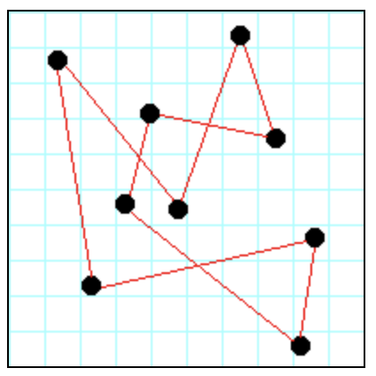

# Traveling Salesman

This coursework considers a simplified version of the travelling salesman problem.

## Purposes of this assignment

- To give you more practice with writing tests.
- To get you started thinking about how to solve problems with programs.

## General idea of the assignment

Suppose there are a number of "cities", as in shown in Figure 1 below:


The distance between any two cities is the standard Euclidean distance, that is, 

√((x<sub>1</sub>-x<sub>2</sub>)<sup>2</sup>+(y<sub>1</sub>-y<sub>2</sub>)<sup>2</sup>)

A traveling salesman wishes to visit every city exactly once, 
then return to their starting point. (It doesn't matter what city is 
the starting point.) Such a path is called a *circuit*, 
as in Figure 2 below:



However, the salesman also wishes to minimise the total distance that 
must be traveled.

This is a classic computer science problem, known as the 
**Traveling Salesman problem**. You can find algorithms for 
finding reasonably good solutions on the web, and you are welcome to look 
at those algorithms. However, we want you use a *hill climbing& approach, 
where you start with "any" solution, and try to progressively improve 
it until you can't improve it any more.

This should require you to think about how to solve the problem, 
rather than just copying some algorithm you may or may not understand. 
Your final solution is unlikely to be the *optimal* 
(best possible) solution, but that's okay, so long as it isn't 
obviously terrible.

## Specific requirements

### Data representation

We are providing a file, `city-data.txt`, containing the 
latitudes and longitudes of the fifty state capitals of the U.S.A. 
Each line contains:
- the name of the state, 
- the name of the city, 
- the latitude, and 
- the longitude. 

These four items are separated by **tabs**. 
Read this file in as a list of four-tuples.
The list tuples will be referred to as a *"road map"*. 
It represents the path the salesman follows, starting with the 
first city in the list and ending back at the first city in the list.

While we will require these particular data representations as 
function parameters and function results, this does not imply that 
you have to work with these representations as you solve the problems.
Python makes it easy to convert from one kind of sequence to another.

### Required functions (file `cities.py`)

`def read_cities(file_name)`
>  Read in the cities from the given `file_name`, and return 
>  them as a list of four-tuples: 
  ```
  [(state, city, latitude, longitude), ...] 
  ```
  Use this as your initial `road_map`, that is, the cycle 
  ```
  Alabama -> Alaska -> Arizona -> ... -> Wyoming -> Alabama.
  ```
  
`def print_cities(road_map)`
> Prints a list of cities, along with their locations. 
> Print only one or two digits after the decimal point.

`def compute_total_distance(road_map)`
> Returns, as a floating point number, the sum of the distances of all 
> the connections in the `road_map`. Remember that it's a cycle, so that 
> (for example) in the initial `road_map`, Wyoming connects to Alabama...

`def swap_adjacent_cities(road_map, index)`
> Take the city at location `index` in the `road_map`, and the city at 
> location `index+1` (or at `0`, if `index` refers to the last element 
> in the list), swap their positions in the `road_map`, compute the 
> new total distance, and 
> return the tuple 
```
(new_road_map, new_total_distance)
```

`def swap_cities(road_map, index1, index2)`
> Take the city at location `index` in the `road_map`, and the 
> city at location `index2`, swap their positions in the `road_map`, 
> compute the new total distance, and return the tuple 
```
(new_road_map, new_total_distance)
``` 
Allow for the possibility that `index1=index2`, 
and handle this case correctly.

`def find_best_cycle(road_map)`
> Using a combination of `swap_cities` and `swap_adjacent_cities`, 
> try `10000` swaps, and each time keep the best cycle found so far. 
> After `10000` swaps, return the best cycle found so far.

`def print_map(road_map)`
> Prints, in an easily understandable format, the cities and 
> their connections, along with the cost for each connection 
> and the total cost.

`def main()`
> Reads in, and prints out, the city data, then creates the *"best"* 
cycle and prints it out.

### Required tests (file `cities_test.py`)

Programs should be tested as thoroughly as possible using 
the `pytest` unit testing framework. Functions that do input or output 
are difficult to test. Therefore, those functions, should do as little 
computation as possible, and functions that do computation, should do no 
input or output.

In this assignment `main`, `read_cities`, `print_cities`, and 
`print_map` result in input or output, so you do not need to 
write unit tests for these. Provide unit tests for all the 
other functions, as well as any additional computational 
functions you might write.

### Reminder: TDD, Test Driven Design, really is a good idea. 

Here is the general approach:

1. Write a *stub* for each function. 
   (A *stub* is a function that does nothing or, if it must return a 
   value, returns a value that is unlikely to be correct.)
2. Pick a function - if possible, one that does not depend on any other 
   functions you haven't yet written - and write a test for it. 
   Run the test and make sure it fails.
3. Improve the function just enough to make it pass the test.
4. If the function needs to do more, then expand the test 
   (or add another test) to test the new functionality. 
   Run the test and make sure it fails. Then return to step 3. 
   Repeat as many times as necessary until the function is complete.
5. If any functions remain to be written, return to step 2.

## Programming hints

- You don't need any global variables.
- Import `random` at the top of your program; then 
  ```
  number = 1000 * random.random() 
  ```
  will give you a floating-point number in the 
  range `0.0 <= number < 1000.0`.
- If you want to treat a list `lst` as circular (the first item 
  follows the last item), the item after `lst[i]` is not just `lst(i + 1)`,
  but is `lst[(i + 1) % len(lst)]`.
- If you haven't yet read the *Unit Testing* notes, 
  now would be a good time to do so.
- Don't use *magic numbers*! For example, there happen to be fifty 
  cities in the data set you are given, but don't use fifty in your 
  code;  you can use something like `len(city_list)` instead.
  
## Grading

The assignment will be graded on the basis of 100 points total:

- **Correctness**. We will have our own unit tests, 
  which your functions must pass. This means that 
  1. the above functions must take parameters and produce results 
     exactly as specified, or our test will fail and cost you points, and
  2. your own unit tests should be good enough to catch any errors 
     before we do.
- **Style**.
  - Use proper indentation and spacing. 
  - Use good, self-explanatory variable and function names. 
  - Don't repeat code if you can put it in a function and just call 
    the function.  
  - Try to avoid redundancy (such as the beginner's `if better == True`).