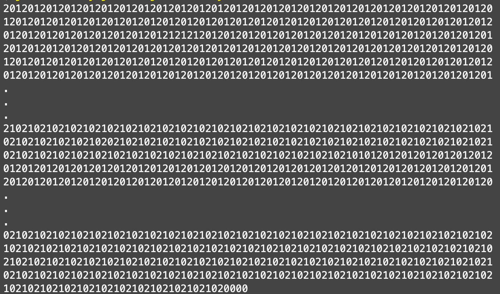

# Worksheet on Java Concurrency

These exercises examine some of the key features of the `java.util.concurrent` package.


## Exercise 1: Threads

Write a program that runs three threads in parallel:

+ One that writes the numeral '0' 5000 times
+ One that writes the numeral '1' 5000 times
+ One that writes the numeral '2' 5000 times

The purpose is only to show how to set up and run threads, not how to use them effectively.

```java
/**
 * Application class with a main() method that illustrates three simple
 * threads running concurrently: one that writes zeros, one that writes
 * ones, and one that writes twos.  Each thread writes to standard
 * output.  The result should be a large trinary number.
 */
```


 
## Exercise 2: Sum using Executor or ForkJoin

Write a function to sum all the values in an array, using one thread to sum up the first half of the values and the other thread to sum the rest. 
Here the threads must wait for each other to complete before the function can combine the results from 
each thread and return the sum.


## Exercise 3: A shared counter

This problem acts as a refresher of your existing Java knowledge of threads.

We consider the Java programs under the `ex01` directory. 
Specifically, we have two versions of a `Counter` class and one test class `Main`.
The main method creates a `Counter` object and runs two threads on it, 
both running its `run()` method, which updates the shared counter. 
After both threads have updated the counter 100000 times, they finish and its value is printed. 
The expected output is 200000. Compile and run the program and observer the results.

The results that you get may depend on the hardware, operating system and the version of the Java environment. 
If you are running the code on a multi-core machine, it is quite likely that at least some of the runs 
will give different results than 200000.
The reason for this is that incrementing the counter is in fact not one basic operation, but two. 
Code `counter++` gets compiled into something like the following:

```java
int tmp = counter;
counter = tmp + 1;
```

So while one thread is about to write the new value to the shared counter variable the other one might update it several times (or even very many times) in the mean time. 
The Java standard does not guarantee that the threads will run *synchronized* in any way. 
In fact they often are completely *unsynchronized* and execute in a very surprising order. 
Whenever a particular order of executing code in different threads causes the program to make an error, 
we call it a *race condition*. 
In this case it’s a race condition between two threads reading and updating the same counter.

How do we fix this problem? 
One possible way is to restrict the way in which operations of the two threads may be ordered. 
In particular, we don’t want one thread to read and change the counter when the other one has read it 
but not updated it yet.

In short, we want to make sure that at most one thread at a time is executing the code that reads and updates the counter. 
This property is called *mutual exclusion* and one way to achieve it is to use the `synchronized` 
keyword in Java. 
Therefore we need to replace the line `counter++` with this code:

```java
synchronized (this) {
          counter++;
}
```

What we have added is a *synchronized block*, which makes sure that no other synchronized block from the same object (`this`) executes at the same time. 
In our case, this means that the other thread, which tries to enters the synchronized block on the same `Counter` object, will have to wait until the first thread leaves the block.

Recompile and run the example, and now the printed value should always be 200000. 
We haven’t changed the actual operations performed by the program, but by controlling the order in 
which operations are performed we made sure that the result will be correct.

Now comes the main part of the exercise. 
Your task is to find out what could be the least value of the counter reported by the original, unsynchronized, program. 
You will also have to demonstrate that happening. 
Instead of running the program a huge number of times and hoping to get the very unlikely result, 
you will be able to pause the threads in strategic moments to get a good chance of getting the results.

Start by taking the original program (without the synchronized block) and replace `counter++` with:

```java
int tmp = counter;
counter = tmp + 1;
```

Now you will add a number of lines like this to the loop:

```java
if (id == ?? && i == ??) Thread.sleep(??);
```

Each line will delay one thread on a specific iteration of the loop by a specific number of milliseconds. 
To be able to tell which thread you are in, you have to add this code to the beginning of the `run()` method:

```java
int id;
String name = Thread.currentThread().getName();
id = name.equals("thread1") ? 1 : 2;
```

Note that in normal programs you should identify threads by using your own data (for example integers) as identifiers; `Thread.getName()` is good for debugging. 
Also, because `Thread.sleep()` is interruptible, it may throw a `InterruptedException`, 
which we have to catch. 
This exception is used to for safe thread cancellation, and we will not deal with this topic in this exercise - instead, we will just catch it and ignore it. 
For that, you need to uncomment the `try-catch` block in the `run()` method.
This is shown in the second version of `Counter` in the package `ex01.ex01b`.

Find out what is the least number the program could report and demonstrate this by inserting delays.

## Exercise 4: Interleaved = no!

Here we want to write, to standard output, all the prime numbers in the range $2..n$, where $n$ is a command line argument. 
We do this using $n-1$ threads, each with the responsibility of determining whether or not a different 
value in the range is prime and writing it if it is prime. 

The interesting thing here is to make sure that a thread gets exclusive access to standard output to 
write out the whole number; otherwise with interleaved output we could get composite numbers written out.

## Exercise 5: Basic concurrency

Consider an implementation of the dining philosophers problem in which the first four philosophers always pick up their right chopstick first, but the fifth philosopher always picks up her left chopstick first. 
Can deadlock occur? Why or why not?


## Exercise 6: Fairness

Study the documentation for `java.util.concurrent.Semaphore` and, if possible, write an analysis of why `tryAcquire()` without a timeout can break fairness, but `tryAcquite(0, TimeUnit.SECONDS)` does not.

## Exercise 7: Cyclic Barrier

Write a Java application that returns the sum of the values in an integer array by partitioning the array into `N` parts, each of which are summed by a unique thread. 
Use a cyclic barrier whose runnable sums the partial sums.

## Exercise 8: Semaphores

Rewrite the Java dining philosophers application to use a semaphore for the table and explicit locks for chopsticks.


