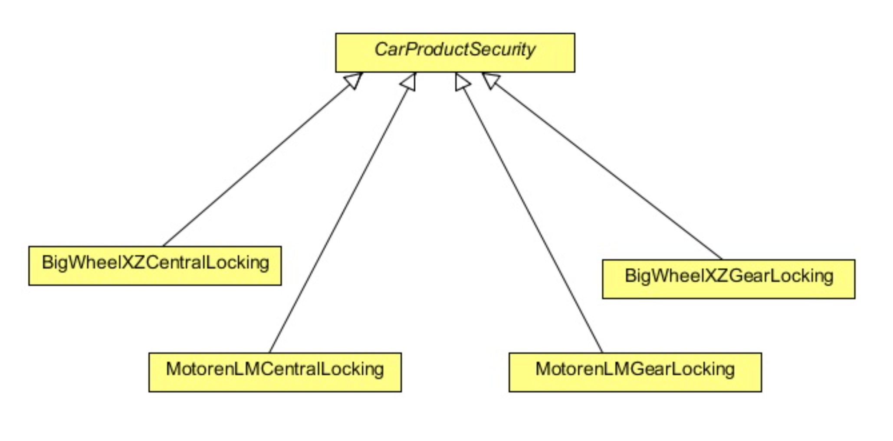

# Worksheet on Design Patterns - Part II

In these exercises we will be examining the following design patterns:

1. Strategy,
2. Abstract Factory, 
3. Builder,
4. Facade,
5. Bridge, and
6. Composite.

## Short form questions

1. 
	+ Briefly describe the *Strategy* design pattern?
	+ When is it appropriate to use the *Strategy* design pattern?

2. When is it appropriate to use the *Abstract Factory* design pattern?

3. > "In general, the details of object construction, such as instantiating and initialising the components 
   > that comprise the object, are kept within the object, often as part of its constructor.”

	Comment on this statement with reference to modularity and construction bloat.
	
4. 
	+ What is the *Facade* design pattern?
	+ When, and why, would you use the *Facade* design pattern?
	
5. When should one make use of the *Bridge* design pattern?

6. 
	+ What is the *Composite* design pattern?
	+ Under what conditions would you use a *Composite* design pattern?
	+ What are the four participants of the *Composite* design pattern?
	
## Long form questions

1. Create a text formatter for a text editor. A text editor can have different text formatters to 
format text. We can create different text formatters and then pass the required one to the text editor, so that 
the editor will able to format the text as required.

	The text editor will hold a reference to a common interface for the text formatter and the editor's job 
	will be to pass the text to the formatter to format the text. You are required to implement this outline 
	using the *Strategy* design pattern which will make the code flexible and maintainable.

	Below is the `TextFormatter` interface which is implemented by all the concrete formatters, which
	contains only one method, `format`, used to format the text.
	```java
	public interface TextFormatter {	
		public void format(String text);
	}
	```
	Some sample test code might look like:
	```java
	public class TestStrategyPattern {

		public static void main(String[] args) {
			TextFormatter formatter = new CapTextFormatter();
			TextEditor editor = new TextEditor(formatter);
			editor.publishText("Testing text in caps formatter");
		
			formatter = new LowerTextFormatter();
			editor = new TextEditor(formatter);
			editor.publishText("Testing text in lower formatter");
		}
	}
	```
	The above code should result to the following output:
	```
	[CapTextFormatter]: TESTING TEXT IN CAPS FORMATTER
	[LowerTextFormatter]: testing text in lower formatter
	```
2. A product company, *Bigfish*, has changed the way they take orders from their clients. 
The company uses an application to take orders from them. 
They receive orders, errors in orders, feedback for the previous order, and responses to the order, 
in an XML format.

	Now the clients don’t want to follow the company’s specific XML rules. 
	The clients want to use their own XML rules to communicate with "Bigfish". 
	This means that for every client, the company should have client specific XML parsers. 
	For example, for the NYC client there should be four specific types of XML parsers, i.e.,
	+ `NYCErrorXMLParser`, 
	+ `NYCFeedbackXML`, 
	+ `NYCOrderXMLParser`, 
	+ `NYCResponseXMLParser`
	
	and four different parsers for the London client.
	
	The company has asked you to change the application according to the new requirements. 
	To develop the parser for the original application they used a *Factory Method* design pattern in which 
	the exact object to use is decided by the subclasses according to the type of parser. 
	Now, to implement the new requirements, you are required to use a factory of factories, 
	i.e., an *Abstract Factory*.
	
	**Note**: You will need parsers according to client specific XMLs, so you will create different 
	factories for different clients which will provide the client specific XML to parse. 
	You will achieve this by creating an *Abstract Factory* and then implement the factory to provide a 
	client specific XML factory. 
	Then you will use that factory to get the desired client specific XML parser object.
	
	To implement the pattern you first need to create an interface that will be implemented by all the 
	concrete factories:
	```java
	public interface AbstractParserFactory {
		public XMLParser getParserInstance(String parserType);
	}
	```
	The above interface is implemented by the client specific concrete factories which will provide the 
	XML parser object to the client object. 
	The `getParserInstance` method takes the `parserType` as an argument which is used to get 
	the message specific (error parser, order parser etc) parser object.
	
	The following is a test class for the resulting code: 
	```java
	public class TestAbstractFactoryPattern {
		public static void main(String[] args) {

			AbstractParserFactory parserFactory = ParserFactoryProducer.getFactory("NYFactory");
			XMLParser parser = parserFactory.getParserInstance("NYORDER");
			String msg="";
			msg = parser.parse();
			System.out.println(msg);

			System.out.println("************************************");

			parserFactory = ParserFactoryProducer.getFactory("TWFactory");
			parser = parserFactory.getParserInstance("TWFEEDBACK");
			msg = parser.parse();
			System.out.println(msg);
		}
	}
	```
	The above code will result to the following output:
	```
	NY Parsing order XML...
	NY Order XML Message
	************************************
	TW Parsing feedback XML...
	TW Feedback XML Message
	```
	
3. As an example of the *Builder* design pattern, consider a Car company which displays its different cars 
to its customers using a graphical model. 
The company has a graphical tool which displays the car on the screen. 
The requirements of the tool are that it is provided with a car object display. 
The car object should contain the car’s specifications. 
The graphical tool uses these specifications to display the car.

	The company has classified its cars into different groups, e.g., *Sedan*, or *Sports Car*. 
	There is only one car object, and our job is to create the car object according to the classification. 
	For example, for a sedan car, a car object according to the sedan specification should be built or, 
	if a sports car is required, then a car object according to the sports car specification should be built.
	
	Currently, the Company wants only these two types of cars, but it may require other types of cars also 
	in the future. 
	You are required to create two different builders, one of each classification, 
	i.e., for sedan and sports cars. 
	The two builders will help in building the car object according to its specification.
	
	Shown below is the `Car` class which contains some of the important components of the car 
	that are required to construct the complete car object:
	```java
	public class Car {
		private String bodyStyle;
		private String power;
		private String engine;
		private String breaks;
		private String seats;
		private String windows;
		private String fuelType;
		private String carType;
	
		public Car (String carType){
			this.carType = carType;
		}
	
		public String getBodyStyle() {
			return bodyStyle;
		}
	
		public void setBodyStyle(String bodyStyle) {
			this.bodyStyle = bodyStyle;
		}
	
		public String getPower() {
			return power;
		}
	
		public void setPower(String power) {
			this.power = power;
		}
	
		public String getEngine() {
			return engine;
		}
	
		public void setEngine(String engine) {
			this.engine = engine;
		}
	
		public String getBreaks() {
			return breaks;
		}
	
		public void setBreaks(String breaks) {
			this.breaks = breaks;
		}
	
		public String getSeats() {
			return seats;
		}
	
		public void setSeats(String seats) {
			this.seats = seats;
		}
	
		public String getWindows() {
			return windows;
		}
		
		public void setWindows(String windows) {
			this.windows = windows;
		}
	
		public String getFuelType() {
			return fuelType;
		}
		
		public void setFuelType(String fuelType) {
			this.fuelType = fuelType;
		}
	
		@Override
		public String toString(){
			StringBuilder sb = new StringBuilder();
			sb.append("--------------"+carType+"--------------------- \\n");
			sb.append(" Body: ");
			sb.append(bodyStyle);
			sb.append("\\n Power: ");
			sb.append(power);
			sb.append("\\n Engine: ");
			sb.append(engine);
			sb.append("\\n Breaks: ");
			sb.append(breaks);
			sb.append("\\n Seats: ");
			sb.append(seats);
			sb.append("\\n Windows: ");
			sb.append(windows);
			sb.append("\\n Fuel Type: ");
			sb.append(fuelType);
		
			return sb.toString();
		}
	}
	```
	You should be able to test your implementation using the following `TestBuilderPattern` class:
	```java
	public class TestBuilderPattern {
		public static void main(String[] args) {
			CarBuilder carBuilder = new SedanCarBuilder();
			CarDirector director = new CarDirector(carBuilder);
			
			director.build();
		
			Car car = carBuilder.getCar();
			System.out.println(car);
		
			carBuilder = new SportsCarBuilder();
			director = new CarDirector(carBuilder);
			director.build();
			car = carBuilder.getCar();
			System.out.println(car);
		}
	}
	```
	The above code will result to the following output:
	```
	--------------SEDAN--------------------- 
 Body: External dimensions: overall length (inches): 202.9, overall width (inches): 76.2, overall height (inches): 60.7, wheelbase (inches): 112.9, front track (inches): 65.3, rear track (inches): 65.5 and curb to curb turning circle (feet): 39.5
 Power: 285 hp @ 6,500 rpm; 253 ft lb of torque @ 4,000 rpm
 Engine: 3.5L Duramax V 6 DOHC
 Breaks: Four-wheel disc brakes: two ventilated. Electronic brake distribution
 Seats: Front seat center armrest.Rear seat center armrest.Split-folding rear seats
 Windows: Laminated side windows.Fixed rear window with defroster
 Fuel Type: Gasoline 19 MPG city, 29 MPG highway, 23 MPG combined and 437 mi. range
--------------SPORTS--------------------- 
 Body: External dimensions: overall length (inches): 192.3, overall width (inches): 75.5, overall height (inches): 54.2, wheelbase (inches): 112.3, front track (inches): 63.7, rear track (inches): 64.1 and curb to curb turning circle (feet): 37.7
 Power: 323 hp @ 6,800 rpm; 278 ft lb of torque @ 4,800 rpm
 Engine: 3.6L V 6 DOHC and variable valve timing
 Breaks: Four-wheel disc brakes: two ventilated. Electronic brake distribution. StabiliTrak stability control
 Seats: Driver sports front seat with one power adjustments manual height, front passenger seat sports front seat with one power adjustments
 Windows: Front windows with one-touch on two windows
 Fuel Type: Gasoline 17 MPG city, 28 MPG highway, 20 MPG combined and 380 mi. range
	```
	
4. "BetterBisc" is product based company and it has launched a product in the market, named "Schedule Server".
It is a kind of server in itself, and it is used to manage jobs. 
The jobs could be any kind of jobs like sending a list of emails, SMS, 
reading or writing files from a destination, or just simply transferring files from 
a source to the destination.

	The product is used by the developers to manage such types of job and enables them to concentrate on their 
	business goals. 
	The server executes each job at their specified time and also manages any underling issues 
	like concurrency, security, etc. 
	As a developer, one just needs to code the relevant business requirements and a good amount of API calls is
	provided to schedule a job according to their needs.
	
	Everything was going fine, until the clients started complaining about starting and stopping the the
	server. 
	Although the server is working well, the initialisation and the shut down processes are very complex and
	they want an easy way to do that. 
	The server has exposed a complex interface to the clients which looks a bit *busy* to them.
	
	We need to provide an easy way to *start* and *stop* the server.

	A complex interface to the client is already considered as a fault in the design of the current system. 
	Fortunately or unfortunately, we cannot start the design and the coding from scratch. 
	We need a way to resolve this problem and make the interface easy to access.
	
	The problem faced by the clients in using the schedule server is the complexity brought by the server 
	in order to start and stop its services. 
	The client wants a simple way to do it. 
	The following is the code that clients required to write to start and stop the server.
	```java
	ScheduleServer scheduleServer = new ScheduleServer();	
	```
	To start the server, the client needs to create an object of the `ScheduleServer` class and then 
	needs to call the following methods (in sequence) to start and initialise the server.
	```java
	scheduleServer.startBooting();
	scheduleServer.readSystemConfigFile();
	scheduleServer.init();
	scheduleServer.initializeContext();
	scheduleServer.initializeListeners();
	scheduleServer.createSystemObjects();
	System.out.println("Start working......");
	System.out.println("After work done.........");	
	```
	To stop the server, the client needs to call the following methods in sequence:
	```java
	scheduleServer.releaseProcesses();
	scheduleServer.destory();
	scheduleServer.destroySystemObjects();
	scheduleServer.destoryListeners();
	scheduleServer.destoryContext();
	scheduleServer.shutdown();	
	```
	To resolve this, you will create a *Facade* class which will *wrap* a server object. 
	This class will provide simple interfaces (methods) for the client. 
	These interfaces internally will call the methods on the server object. 
	```java
	public class ScheduleServerFacade {
		private final ScheduleServer scheduleServer;
	
		public ScheduleServerFacade(ScheduleServer scheduleServer){
			this.scheduleServer = scheduleServer;
		}
	
		public void startServer(){		
			scheduleServer.startBooting();
			scheduleServer.readSystemConfigFile();
			scheduleServer.init();
			scheduleServer.initializeContext();
			scheduleServer.initializeListeners();
			scheduleServer.createSystemObjects();
		}
	
		public void stopServer(){		
			scheduleServer.releaseProcesses();
			scheduleServer.destory();
			scheduleServer.destroySystemObjects();
			scheduleServer.destoryListeners();
			scheduleServer.destoryContext();
			scheduleServer.shutdown();
		}
	}
	```
	The code below shows how facade makes a complex interface simple to use:
	```java
	public class TestFacade {
		public static void main(String[] args) {
			ScheduleServer scheduleServer = new ScheduleServer();
			ScheduleServerFacade facadeServer = new ScheduleServerFacade(scheduleServer);
			facadeServer.startServer();
		
			System.out.println("Start working......");
			System.out.println("After work done.........");
		
			facadeServer.stopServer();
		}
	}
	```

5. "Dodgy Security Systems" is a security and electronic company which produces and assembles products 
for cars. 
It delivers any car electronic or security system you want, from air bags to GPS tracking system, reverse 
parking system, etc. 
The company uses a well defined object oriented approach to keep track of their products using software which 
is developed and maintained only by them. 
They receive a vehicle, produce the system for it, and then assemble it and install it into the vehicle.

	Recently, they received new orders from "BigWheel" (a car company) to produce central locking and gear 
	lock systems for their new car model. 
	To maintain this, they are creating a new software system. 
	They started by creating a new abstract class `CarProductSecurity`, in which they kept some car 
	specific methods and some of the features which they thought are common to all security products. 
	Then they extended the class and created two different sub classes:
	+ `BigWheelCentralLocking`, and 
	+ `BigWheelGearLocking`.
	
	The class diagram is as follows:
	```
	
	```
	After a while, another car company "Motoren" asked them to produce a new system of central locking and 
	gear lock for their new model. 
	Since, the same security system cannot be used in both models of different cars, 
	"Dodgy Security Systems" has produced a new system for them, and also has created two new classes:
	+ `MotorenCentralLocking`, and 
	+ `MotorenGearLocking`.
	
	which also extend the `CarProductSecurity` class. 
	Now the new class diagram looks like this:
	```
	
	```
	what happens if another car company demands another new system for central locking and gear lock? 
	One would need to create another two new classes for it. 
	This design will create one class per system, or worse, if a reverse parking system is produced for 
	each of these two car companies, two more new classes will be created for each of them.
	
	Provide a solution to this problem using an implementation of the *Bridge* design pattern. 
	We provide an appropriate test method:
	```java
	public class TestBridgePattern {
		public static void main(String[] args) {
			Product product = new CentralLocking("Central Locking System");
			Product product2 = new GearLocking("Gear Locking System");
			Car car = new BigWheel(product , "BigWheel xz model");
			car.produceProduct();
			car.assemble();
			car.printDetails();
		
			System.out.println();
		
			car = new BigWheel(product2 , "BigWheel xz model");
			car.produceProduct();
			car.assemble();
			car.printDetails();
		
			System.out.println("-----------------------------------------------------");
		
			car = new Motoren(product, "Motoren lm model");
			car.produceProduct();
			car.assemble();
			car.printDetails();
		
			System.out.println();
		
			car = new Motoren(product2, "Motoren lm model");
			car.produceProduct();
			car.assemble();
			car.printDetails();	
		}
	}
	```
	which should produce the following output:
	```
	Producing Central Locking System
	Modifing product Central Locking System according to BigWheel xz model
	Assembling Central Locking System for BigWheel xz model
	Car: BigWheel xz model, Product:Central Locking System

	Producing Gear Locking System
	Modifing product Gear Locking System according to BigWheel xz model
	Assembling Gear Locking System for BigWheel xz model
	Car: BigWheel xz model, Product:Gear Locking System
	-----------------------------------------------------
	Producing Central Locking System
	Modifing product Central Locking System according to Motoren lm model
	Assembling Central Locking System for Motoren lm model
	Car: Motoren lm model, Product:Central Locking System

	Producing Gear Locking System
	Modifing product Gear Locking System according to Motoren lm model
	Assembling Gear Locking System for Motoren lm model
	Car: Motoren lm model, Product:Gear Locking System
	```
	
6. HTML is hierarchical in nature, its starts from an `<html>` tag which is the parent or the root tag, 
and it contains other tags which can be a parent or a child tag. 
The *Composite* design pattern in Java can be implemented using the component class as an abstract class 
or an interface. 
In this question, you will use an abstract class which contains all the important methods used in a 
composite class and a leaf class.
	```java
	import java.util.List;

	public abstract class HtmlTag {
		public abstract String getTagName();
		public abstract void setStartTag(String tag);
		public abstract void setEndTag(String tag);
		public void setTagBody(String tagBody){
			throw new UnsupportedOperationException("Current operation is not support for this object");
		}
	
		public void addChildTag(HtmlTag htmlTag){
			throw new UnsupportedOperationException("Current operation is not support for this object");
		}
	
		public void removeChildTag(HtmlTag htmlTag){
			throw new UnsupportedOperationException("Current operation is not support for this object");
		}
	
		public List<HtmlTag>getChildren(){
			throw new UnsupportedOperationException("Current operation is not support for this object");
		}
	
		public abstract void generateHtml();
	}
	```
	Given the above class complete two subclasses of the class:
	+ `HtmlParentElement` — handles the *child* nodes, and
	+ `HtmlElement` — handles the *leaf* nodes.
	
	The following class should be used to test out your classes:
	```java
	public class TestCompositePattern {
		public static void main(String[] args) {
			HtmlTag parentTag = new HtmlParentElement("<html>");
			parentTag.setStartTag("<html>");
			parentTag.setEndTag("</html>");
		
			HtmlTag p1 = new HtmlParentElement("<body>");
			p1.setStartTag("<body>");
			p1.setEndTag("</body>");
		
			parentTag.addChildTag(p1);
		
			HtmlTag child1 = new HtmlElement("<p>");
			child1.setStartTag("<p>");
			child1.setEndTag("</p>");
			child1.setTagBody("Testing html tag library");
			p1.addChildTag(child1);
		
			child1 = new HtmlElement("<p>");
			child1.setStartTag("<p>");
			child1.setEndTag("</p>");
			child1.setTagBody("Paragraph 2");
			p1.addChildTag(child1);
		
			parentTag.generateHtml();
		}
	}
	```
	The above code will result to the following output:
	```
	<html>
	<body>
	<p>Testing html tag library</p>
	<p>Paragraph 2</p>
	</body>
	</html>
	```
	
