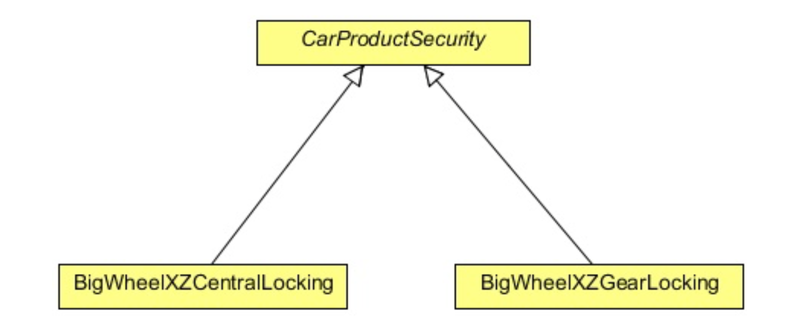

# Worksheet on Design Patterns - Part II

## Structural Design Patterns

In these exercises we will be examining the following design patterns:

1. Adapter 
2. Bridge
3. Composite 
4. Decorator 
5. Façade
6. Flyweight 
7. Proxy

--

1. We now consider the *Adapter* design pattern.

	A software developer, Max, has worked on an e-commerce website. 
The website allows users to shop and pay online. The site is integrated with a third party 
payment gateway, through which users can pay their bills using their credit card. 
Everything was going well, until his manager called him for a change in the project.

	The manager has told him that they are planning to change the payment gateway vendor, 
and Max has to implement that in the code. The problem that arises here is that the site 
is attached to the `Xpay` payment gateway which takes an `Xpay` type of object. 
The new vendor, `PayD`, only allows the `PayD` type of objects to allow the process. 
Max doesn't want to change the whole set of a hundred classes which have reference to an 
object of type `XPay`. He cannot change the third party tool provided by the payment gateway. 

	The problem arises due to the incompatible interfaces between the two different parts of 
the code. To get the process to work, Max needs to find a way to make the code 
compatible with the vendor's provided API.

	The current code interface is not compatible with the new vendor's interface. What Max 
needs here is an *Adapter* which can sit in between the code and the vendor's API, 
enabling the transaction to proceed.

	```java
	public interface Xpay {
	
		public String getCreditCardNo();
		public String getCustomerName();
		public String getCardExpMonth();
		public String getCardExpYear();
		public Short getCardCVVNo();
		public Double getAmount();
	
		public void setCreditCardNo(String creditCardNo);
		public void setCustomerName(String customerName);
		public void setCardExpMonth(String cardExpMonth);
		public void setCardExpYear(String cardExpYear);
		public void setCardCVVNo(Short cardCVVNo);
		public void setAmount(Double amount);	
	}
	```

	The `Xpay` interface contains setter and getter methods to get the information about 
the credit card and customer name. The interface is implemented in the following code which is 
used to instantiate an object of this type, and exposes the object to the 
vendor's API (`XpayImpl` on the repository).

	The new vendor's interface looks like this:
	```java
	public interface PayD {
	
		public String getCustCardNo();
		public String getCardOwnerName();
		public String getCardExpMonthDate();
		public Integer getCVVNo();
		public Double getTotalAmount();
	
		public void setCustCardNo(String custCardNo);
		public void setCardOwnerName(String cardOwnerName);
		public void setCardExpMonthDate(String cardExpMonthDate);
		public void setCVVNo(Integer cVVNo);
		public void setTotalAmount(Double totalAmount);
	}
	```
	As you can see, this interface has a set of different methods which need to be implemented 
	in the code. However, `Xpay` objects are created by most parts of the code, 
	and it is difficult (and risky) to change the entire set of classes.
	We need some way, that's able to fulfil the vendor's requirement to process the payment 
	and also make less or no change to the current code base. 

	You are required to use the *Adapter* pattern to implement a `XpayToPayDAdapter` 
	class to meet the requirements. 
	We can test your class to see whether it can solve the Max’s problem using
	the `RunAdapterExample` class from the repository.

2. This question concerns the *Bridge* design pattern.

	"Dodgy Security Systems" is a security and electronic company which produces and assembles products 
for cars. 
It delivers any car electronic or security system you want, from air bags to GPS tracking system, reverse 
parking system, etc. 
The company uses a well defined object oriented approach to keep track of their products using software which 
is developed and maintained only by them. 
They receive a vehicle, produce the system for it, and then assemble it and install it into the vehicle.

	Recently, they received new orders from "BigWheel" (a car company) to produce central locking and gear 
	lock systems for their new car model. 
	To maintain this, they are creating a new software system. 
	They started by creating a new abstract class `CarProductSecurity`, in which they kept some car 
	specific methods and some of the features which they thought are common to all security products. 
	Then they extended the class and created two different sub classes:
	+ `BigWheelCentralLocking`, and 
	+ `BigWheelGearLocking`.
	
	The class diagram is as follows:
	
	
	
	After a while, another car company "Motoren" asked them to produce a new system of central locking and 
	gear lock for their new model. 
	Since, the same security system cannot be used in both models of different cars, 
	"Dodgy Security Systems" has produced a new system for them, and also has created two new classes:
	+ `MotorenCentralLocking`, and 
	+ `MotorenGearLocking`.
	
	which also extend the `CarProductSecurity` class. 
	Now the new class diagram looks like this:


	


	what happens if another car company demands another new system for central locking and gear lock? 
	One would need to create another two new classes for it. 
	This design will create one class per system, or worse, if a reverse parking system is produced for 
	each of these two car companies, two more new classes will be created for each of them.
	
	Provide a solution to this problem using an implementation of the *Bridge* design pattern. 
	We provide an appropriate test class in `TestBridgePattern` from the repository
	which should produce the following output:
	```
	Producing Central Locking System
	Modifing product Central Locking System according to BigWheel xz model
	Assembling Central Locking System for BigWheel xz model
	Car: BigWheel xz model, Product:Central Locking System

	Producing Gear Locking System
	Modifing product Gear Locking System according to BigWheel xz model
	Assembling Gear Locking System for BigWheel xz model
	Car: BigWheel xz model, Product:Gear Locking System
	-----------------------------------------------------
	Producing Central Locking System
	Modifing product Central Locking System according to Motoren lm model
	Assembling Central Locking System for Motoren lm model
	Car: Motoren lm model, Product:Central Locking System

	Producing Gear Locking System
	Modifing product Gear Locking System according to Motoren lm model
	Assembling Gear Locking System for Motoren lm model
	Car: Motoren lm model, Product:Gear Locking System
	```
3. This question concerns the *Composite* design pattern.

	HTML is hierarchical in nature, its starts from an `<html>` tag which is the parent or the root tag, 
and it contains other tags which can be a parent or a child tag. 
The *Composite* design pattern in Java can be implemented using the component class as an abstract class 
or an interface. 
In this question, you will use an abstract class which contains all the important methods used in a 
composite class and a leaf class.
	```java
	import java.util.List;

	public abstract class HtmlTag {
		public abstract String getTagName();
		public abstract void setStartTag(String tag);
		public abstract void setEndTag(String tag);
		public void setTagBody(String tagBody){
			throw new UnsupportedOperationException("Current operation is not support for this object");
		}
	
		public void addChildTag(HtmlTag htmlTag){
			throw new UnsupportedOperationException("Current operation is not support for this object");
		}
	
		public void removeChildTag(HtmlTag htmlTag){
			throw new UnsupportedOperationException("Current operation is not support for this object");
		}
	
		public List<HtmlTag>getChildren(){
			throw new UnsupportedOperationException("Current operation is not support for this object");
		}
	
		public abstract void generateHtml();
	}
	```
	Given the above class complete two subclasses of the class:
	+ `HtmlParentElement` — handles the *child* nodes, and
	+ `HtmlElement` — handles the *leaf* nodes.
	
	The `TestCompositePattern` class, from the repository, should be used to test out your classes.
	The code should produce the following output:
	```
	<html>
	<body>
	<p>Testing html tag library</p>
	<p>Paragraph 2</p>
	</body>
	</html>
	```
	
4. This question concerns the *Decorator* design pattern.

	You are commissioned by a pizza company make an extra topping calculator. 
	A user can ask to add extra topping to a pizza and our job is to add toppings and 
	increase its price using our classes.

	**Please note**: the main aim of the *Decorator* design pattern is to 
	attach additional responsibilities to an object dynamically. 
	Decorators provide a flexible alternative to sub-classing for extending functionality.
	The Decorator prevents the proliferation of subclasses leading to less complexity and confusion.

	For simplicity, let's create a simple `Pizza` interface which contains only two methods:

	```java
	public interface Pizza {
		public String getDesc();
		public double getPrice();
	}
	```
	The `getDesc` method is used to obtain the pizza's description whereas the 
	`getPrice` method is used to obtain the price.

	Provide two implementations of the `Pizza` interface:
	+ `SimplyVegPizza`
	+ `SimplyNonVegPizza`
	
	The decorator wraps the object whose functionality needs to be increased, 
	so it needs to implement the same interface. 
	
	Provide an abstract decorator class which will be extended by all the concrete decorators.

	Now provide several implementations of `PizzaDecorator` and exercise your classes
	with the given test class (`TestDecoratorPattern`)
	+ `Ham implements PizzaDecorator`
	+ `Cheese implements PizzaDecorator`
	+ `Chicken implements PizzaDecorator`
	+ `FetaCheese implements PizzaDecorator`
	+ ...

	The code should produce the following output:
	```
	Desc: SimplyVegPizza (230), Roma Tomatoes (5.20), Green Olives (5.47), Spinach (7.92)
	Price: 248.59
	Desc: SimplyNonVegPizza (350), Meat (14.25), Cheese (20.72), Cheese (20.72), Ham (18.12)
	Price: 423.81
	```
	
5. This question concerns the *Façade* design pattern.

	"BetterBisc" is product based company and it has launched a product in the market, named "Schedule Server".
	It is a kind of server in itself, and it is used to manage jobs. 
	The jobs could be any kind of jobs like sending a list of emails, SMS, 
	reading or writing files from a destination, or just simply transferring files from a source to the 
	destination.

	The product is used by the developers to manage such types of job and enables them to concentrate on their 
	business goals. 
	The server executes each job at their specified time and also manages any underling issues 
	like concurrency, security, etc. 
	As a developer, one just needs to code the relevant business requirements and a good amount of API calls is
	provided to schedule a job according to their needs.
	
	Everything was going fine, until the clients started complaining about starting and stopping the the
	server. 
	Although the server is working well, the initialisation and the shut down processes are very complex and
	they want an easy way to do that. 
	The server has exposed a complex interface to the clients which looks a bit *busy* to them.
	
	We need to provide an easy way to *start* and *stop* the server.

	A complex interface to the client is already considered as a fault in the design of the current system. 
	Fortunately or unfortunately, we cannot start the design and the coding from scratch. 
	We need a way to resolve this problem and make the interface easy to access.
	
	The problem faced by the clients in using the schedule server is the complexity brought by the server 
	in order to start and stop its services. 
	The client wants a simple way to do it. 
	The following is the code that clients required to write to start and stop the server.
	```java
	ScheduleServer scheduleServer = new ScheduleServer();	
	```
	To start the server, the client needs to create an object of the `ScheduleServer` class and then 
	needs to call the following methods (in sequence) to start and initialise the server.
	```java
	scheduleServer.startBooting();
	scheduleServer.readSystemConfigFile();
	scheduleServer.init();
	scheduleServer.initializeContext();
	scheduleServer.initializeListeners();
	scheduleServer.createSystemObjects();
	System.out.println("Start working......");
	System.out.println("After work done.........");	
	```
	To stop the server, the client needs to call the following methods in sequence:
	```java
	scheduleServer.releaseProcesses();
	scheduleServer.destory();
	scheduleServer.destroySystemObjects();
	scheduleServer.destoryListeners();
	scheduleServer.destoryContext();
	scheduleServer.shutdown();	
	```
	To resolve this, you will create a *Facade* class which will *wrap* a server object. 
	This class will provide simple interfaces (methods) for the client. 
	These interfaces internally will call the methods on the server object. 
	```java
	public class ScheduleServerFacade {
		private final ScheduleServer scheduleServer;
	
		public ScheduleServerFacade(ScheduleServer scheduleServer){
			this.scheduleServer = scheduleServer;
		}
	
		public void startServer(){		
			scheduleServer.startBooting();
			scheduleServer.readSystemConfigFile();
			scheduleServer.init();
			scheduleServer.initializeContext();
			scheduleServer.initializeListeners();
			scheduleServer.createSystemObjects();
		}
	
		public void stopServer(){		
			scheduleServer.releaseProcesses();
			scheduleServer.destory();
			scheduleServer.destroySystemObjects();
			scheduleServer.destoryListeners();
			scheduleServer.destoryContext();
			scheduleServer.shutdown();
		}
	}
	```
	The code below shows how facade makes a complex interface simple to use:
	```java
	public class TestFacade {
		public static void main(String[] args) {
			ScheduleServer scheduleServer = new ScheduleServer();
			ScheduleServerFacade facadeServer = new ScheduleServerFacade(scheduleServer);
			facadeServer.startServer();
		
			System.out.println("Start working......");
			System.out.println("After work done.........");
		
			facadeServer.stopServer();
		}
	}
	```
6. This question concerns the *Flyweight* design pattern.

	Sometimes the objects in an application might have great similarities and be of a similar kind 
	(a similar kind here means that most of their properties have similar values and only a few of 
	them vary in value). 
	In case they are also heavy objects to create, they should be controlled by the application developer. 
	Otherwise, they might consume much of the memory and eventually slow down the whole application.

	The Flyweight design pattern is designed to control such kind of object creation and provides 
	you with a basic caching mechanism. 
	It allows you to create one object per type (the type here differs by a property of that object), 
	and if you ask for an object with the same property (already created), 
	it will return you the same object instead of creating a new one.

	The X-programming site allows users to create and execute programs using their favourite 
	programming language. 
	It provides you with plenty of programming language options. 
	You choose one, write a program with it and execute it to see the result.

	Now the site has started losing its users, the reason being the slowness of the site. 
	The users are not interested in it any more. 
	The site is very popular and sometimes there could be more than thousands of programmers using it. 
	Because of that, the site is crawling. 
	The heavy usage is not the real problem behind the slowness of the site. 
	Let us see the core programming of the site which allows users to run and execute their program, 
	and the true issue will be revealed there.
	```java
	public class Code {	
		private String code;

		public String getCode() {
			return code;
		}

		public void setCode(String code) {
			this.code = code;
		}
	}
	```	
	The above class is used to set the code done by the programmer in order to get it executed. 
	The `Code` object is a lightweight simple object having a property code along with its setter and getter.
	```java
	public interface Platform {
		public void execute(Code code);
	}
	```
	The `Platform` interface is implemented by the language specific platform to execute the code. 
	It has one method, executes, which takes the `Code` object as its parameter.
	```java
	public class JavaPlatform implements Platform {
		public JavaPlatform(){
			System.out.println("JavaPlatform object created");
		}
	
		@Override
		public void execute(Code code) {
			System.out.println("Compiling and executing Java code.");
		}
	}
	```
	The above class implements the `Platform` interface and provides an implementation for the `execute`
	method, to execute the code in Java.
	
	To execute the code, a `Code` object which contains the code and a `Platform` object to execute the 
	code are created. 
	The code should look like this:
	```java
	Platform platform = JavaPlatform()
  	platform.execute(code)
	```
	The intent of the flyweight design pattern is to use shared objects to support large numbers of 
	fine-grained objects efficiently. 
	A flyweight is a shared object that can be used in multiple contexts simultaneously. 
	The flyweight acts as an independent object in each context — it’s indistinguishable from an 
	instance of the object that’s not shared. 
	Flyweights cannot make assumptions about the context in which they operate.
	
	The key concept here is the distinction between *intrinsic* and *extrinsic* state. 
	+ Intrinsic state is stored in the flyweight; it consists of information that’s 
		independent of the flyweight’s context, thereby making it sharable.
	+ Extrinsic state depends on and varies with the flyweight’s context and therefore can’t be shared.
	
	Client objects are responsible for passing extrinsic state to the flyweight when it needs it.
	
	To solve the problem, you will need to provide a platform factory class which will control the 
	creation of the `Platform` objects (see `PlatformFactory` from the repository).
	
	Your code should pass the (indicative) tests from `TestFlyweight` (on the repository).
	The code should produce the following output:
	```
	CPlatform object created
	Compiling and executing C code.
	-------------------------------------
	Compiling and executing C code.
	-------------------------------------
	JavaPlatform object created
	Compiling and executing Java code.
	-------------------------------------
	Compiling and executing Java code.
	-------------------------------------
	RubyPlatform object created
	Compiling and executing Ruby code.
	-------------------------------------
	Compiling and executing Ruby code.
	```


7. This question concerns the *Proxy* design pattern which has several variations. 
   Some of the important variations are:
   + Remote Proxy,
   + Virtual Proxy, and 
   + Protection Proxy.
   
   In this question, we will examine these variations.
   
   **a) Remote Proxy**
   
	There is a Pizza Company, which has its outlets at various locations. 
	The owner of the company gets a daily report by the staff members of the company from various outlets. 
	The current application supported by the Pizza Company is a desktop application, not a web application. 
	So, the owner has to ask his employees to generate the report and send it to him. 
	Now the owner wants to generate and check the report by his own, so that he can generate it whenever 
	he wants without anyone’s help. 
	The owner wants you to develop an application for him.
	
	The problem here is that all applications are running at their respective JVMs and the 
	*Report Checker* application (which you will design) should run in the owner’s local system. 
	The object required to generate the report does not exist in the owner’s system JVM and 
	you cannot directly call on the remote object. 
	You should use the *Remote Proxy* design pattern to solve this problem.
	
	The `ReportGenerator` interface is as follows:
	```java
	import java.rmi.Remote;
	import java.rmi.RemoteException;

	public interface ReportGenerator extends Remote{
		public String generateDailyReport() throws RemoteException;
	}
	```
	This is a remote interface which defines the methods that a client can call remotely. 
	It’s what the client will use as the class type for your service. 
	Both the *stub* and *actual* service will implement this. 
	The method in the interface returns a `String` object. 
	You can return any object from the method; this object is going to be shipped over the wire from 
	the server back to the client, so it must be `Serializable`. 
	Please note that all the methods in this interface should throw `RemoteException`.
	```java	
	import java.rmi.Naming;
	import java.rmi.RemoteException;
	import java.rmi.server.UnicastRemoteObject;
	import java.util.Date;

	public class ReportGeneratorImpl extends UnicastRemoteObject implements ReportGenerator{
		private static final long serialVersionUID = 3107413009881629428L;

		protected ReportGeneratorImpl() throws RemoteException {}

		@Override
		public String generateDailyReport() throws RemoteException {
			StringBuilder sb = new StringBuilder();
			sb.append("********************Location X Daily Report********************");
			sb.append("\\n Location ID: 012");
			sb.append("\\n Today's Date: "+new Date());
			sb.append("\\n Total Pizza's Sell: 112");
			sb.append("\\n Total Price: $2534");
			sb.append("\\n Net Profit: $1985");
			sb.append("\\n ***************************************************************");

			return sb.toString();
		}

		public static void main(String[] args) {
			try {
				ReportGenerator reportGenerator = new ReportGeneratorImpl();
				Naming.rebind("PizzaCoRemoteGenerator", reportGenerator);
			} catch (Exception e) {
				e.printStackTrace();
			}
		}
	}
	```
	The final step is to start the service that is, run your concrete implementation of remote class, which 
	in this case is the class `ReportGeneratorImpl`.

	So far, you have created and run a service. 
	You now need a client to use it. 
	The report application for the owner of the pizza company will use this service 
	to generate and check the report.
	```java
	import java.rmi.Naming;

	public class ReportGeneratorClient {

		public static void main(String[] args) {
			new ReportGeneratorClient().generateReport();
		}

		public void generateReport(){
			try {
				ReportGenerator reportGenerator = 
					(ReportGenerator)Naming.lookup("rmi://127.0.0.1/PizzaCoRemoteGenerator");
				System.out.println(reportGenerator.generateDailyReport());
			} catch (Exception e) {
				e.printStackTrace();
			}
		}
	}
	```
	The above program should result in the following output:
	```
	********************Location X Daily Report********************
	Location ID: 012
 	Today's Date: Sun Sep 39 00:11:23 GMT 2016
	Total Pizza Sell: 112
	Total Sale: $2534
	Net Profit: $1985
	***************************************************************	
	```
	
	**b) Virtual Proxy**
	
	The *Virtual Proxy* design pattern is a memory saving technique that recommends postponing 
	an object creation until it is needed; it is used when creating an object the is expensive 
	in terms of memory usage or processing involved.

	Suppose there is a `Company` object in your application and this object contains a list of employees of 
	the company in a `ContactList` object. 
	There could be thousands of employees in a company. 
	Loading the `Company` object from the database along with the list of all its employees in the 
	`ContactList` object could be very time consuming. 
	In some cases you don’t even require the list of the employees, 
	but you are forced to wait until the company and its list of employees loaded into the memory.
	
	One way to save time and memory is to avoid loading of the employee objects until required, 
	and this is done using the *Virtual Proxy*. 
	This technique is also known as *Lazy Loading* where you are fetching the data only when it is required.
	```java
	public class Company {
		private String companyName;
		private String companyAddress;
		private String companyContactNo;
		private ContactList contactList ;

		public Company(String companyName,String companyAddress, 
					   String companyContactNo,ContactList contactList){
			this.companyName = companyName;
			this.companyAddress = companyAddress;
			this.companyContactNo = companyContactNo;
			this.contactList = contactList;

			System.out.println("Company object created...");
		}

		public String getCompanyName() {
			return companyName;
		}

		public String getCompanyAddress() {
			return companyAddress;
		}

		public String getCompanyContactNo() {
			return companyContactNo;
		}

		public ContactList getContactList(){
			return contactList;
		}
	}
	```
	The above `Company` class has a reference to `ContactList` interface whose real object will be 
	load only when requested by a call of the `contactList()` method.
	```java
	import java.util.List;

	public interface ContactList {
		public List<Employee> getEmployeeList();
	}
	```
	The `ContactList` interface only contains one method, `getEmployeeList()`, which is used to obtain 
	the employee list of the company.
	```java
	import java.util.ArrayList;
	import java.util.List;

	public class ContactListImpl implements ContactList{

		@Override
		public List<Employee> getEmployeeList() {
			return getEmpList();
		}

		private static List<Employee>getEmpList(){
			List<Employee> empList = new ArrayList<>(5);
			empList.add(new Employee("Employee A", 2565.55, "SE"));
			empList.add(new Employee("Employee B", 22574, "Manager"));
			empList.add(new Employee("Employee C", 3256.77, "SSE"));
			empList.add(new Employee("Employee D", 4875.54, "SSE"));
			empList.add(new Employee("Employee E", 2847.01, "SE"));
			return empList;
		}
	}
	```
	The above class should create a real `ContactList` object which will return the list of employees of 
	the company. 
	The object will be *loaded on demand*, only when required.
	```java
	import java.util.List;

	public class ContactListProxyImpl implements ContactList{
		private ContactList contactList;

		@Override
		public List<Employee> getEmployeeList() {
			if(contactList == null){
				System.out.println("Creating contact list and fetching list of employees...");
				contactList = new ContactListImpl();
			}
			return contactList.getEmployeeList();
		}
	}
	```
	The `ContactListProxyImpl` is the proxy class which also implements `ContactList` and holds a 
	reference to the real `ContactList` object. 
	On the implementation of the method `getEmployeeList()` it will check if the `contactList` 
	reference is `null`, then it will create a real `ContactList` object and then will 
	invoke the `getEmployeeList()` method on it to get the list of the employees.
	
	The `Employee` class should look something like this:
	```java
	public class Employee {
		private String employeeName;
		private double employeeSalary;
		private String employeeDesignation;

		public Employee(String employeeName,double employeeSalary,String employeeDesignation){
			this.employeeName = employeeName;
			this.employeeSalary = employeeSalary;
			this.employeeDesignation = employeeDesignation;
		}

		public String getEmployeeName() {
			return employeeName;
		}

		public double getEmployeeSalary() {
			return employeeSalary;
		}

		public String getEmployeeDesignation() {
			return employeeDesignation;
		}

		public String toString(){
			return "Employee Name: "+employeeName+", EmployeeDesignation: "+employeeDesignation+", 
									Employee Salary: "+employeeSalary;
		}
	}
	```
	You should then test your code with the `TestVirtualProxy` class from the repository.
	The code should produce the following output:
	```
	Company object created...
	Company Name: ABC Company
	Company Address: Alabama
	Company Contact No.: 011-2845-8965
	Requesting for contact list
	Creating contact list and fetching list of employees...
	Employee Name: Employee A, EmployeeDesignation: SE, Employee Salary: 2565.55
	Employee Name: Employee B, EmployeeDesignation: Manager, Employee Salary: 22574.0
	Employee Name: Employee C, EmployeeDesignation: SSE, Employee Salary: 3256.77
	Employee Name: Employee D, EmployeeDesignation: SSE, Employee Salary: 4875.54
	Employee Name: Employee E, EmployeeDesignation: SE, Employee Salary: 2847.01	
	```
	**c) Protection Proxy**
	
	In general, objects in an application interact with each other to implement the overall 
	application functionality. 
	Most application object are generally accessible to all other objects in the application. 
	At times, it may be necessary to restrict the accessibility of an object only to a limited set of 
	client objects based on their access rights. 
	When a client object tries to access such an object, the client is given access to the services 
	provided by the object only if the client can furnish proper authentication credentials. 
	In such cases, a separate object can be designated with the responsibility of verifying the access
	privileges of different client objects when they access the actual object. 
	
	In other words, every client must successfully authenticate with this designated object to get access 
	to the actual object functionality. 
	Such an object with which a client needs to authenticate to get access to the actual object 
	can be referred as an object authenticator which is implemented using the *Protection Proxy* 
	design pattern.

	We will return to the `ReportGenerator` application that you worked on earlier for the pizza company. 
	The owner now requires that only he can generate the daily report and that no other employee 
	should be able to do so.
	
	To implement this security feature, you are going to use the *Protection Proxy* design pattern 
	which will check if the object which is trying to generate the report is the owner; 
	in this case, the report gets generated, otherwise it will not.
	```java
	public interface Staff {
		public boolean isOwner();
		public void setReportGenerator(ReportGeneratorProxy reportGenerator);
	}
	```
	The `Staff` interface is used by the `Owner` and the `Employee` classes and the interface has two methods: 
	+ `isOwner()` returns a boolean to check whether the calling object is the owner or not.
	+ The other method is used to set the ReportGeneratorProxy which is a protection proxy, used to 
	generate the report.
	
	```java
	public class Employee implements Staff {
		private ReportGeneratorProxy reportGenerator;

		@Override
		public void setReportGenerator(ReportGeneratorProxy reportGenerator){
			this.reportGenerator = reportGenerator;
		}

		@Override
		public boolean isOwner() {
			return false;
		}

		public String generateDailyReport(){
			try {
				return reportGenerator.generateDailyReport();
			} catch (Exception e) {
				e.printStackTrace();
			}
			return "";
		}
	}
	```
	The `Employee` class implements the `Staff` interface, since it’s an employee `isOwner()` 
	method returns `false`. 
	The `generateDailyReport()` method asks `ReportGenerator` to generate the daily report.
	```java
	public class Owner implements Staff {
		private boolean isOwner;
		private ReportGeneratorProxy reportGenerator;
		
		{
			isOwner = true;
		}

		@Override
		public void setReportGenerator(ReportGeneratorProxy reportGenerator){
			this.reportGenerator = reportGenerator;
		}

		@Override
		public boolean isOwner(){
			return isOwner;
		}

		public String generateDailyReport(){
			try {
				return reportGenerator.generateDailyReport();
			} catch (Exception e) {
				e.printStackTrace();
			}
			return "";
		}
	}
	```
	The `Owner` class looks almost the same as the `Employee` class; the only real difference is that the 
	`isOwner()` method returns `true`.
	```java
	public interface ReportGeneratorProxy {
		public String generateDailyReport();
	}
	```
	The `ReportGeneratorProxy` acts as a *Protection Proxy* which has only one method 
	`generateDailyReport()` that is used to generate the report.
	```java
	import java.rmi.Naming;
	import ReportGenerator;

	public class ReportGeneratorProtectionProxy implements ReportGeneratorProxy {
		ReportGenerator reportGenerator;
		Staff staff;

		public ReportGeneratorProtectionProxy(Staff staff) {
			this.staff = staff;
		}

		@Override
		public String generateDailyReport() {
			if(staff.isOwner()){
				ReportGenerator reportGenerator = null;
				try {
					reportGenerator = (ReportGenerator)
									Naming.lookup("rmi://127.0.0.1/PizzaCoRemoteGenerator");
					return reportGenerator.generateDailyReport();
				} catch (Exception e) {
					e.printStackTrace();
				}
				return "";
			}
			else {
				return "Not Authorized to view report.";
			}
		}
	}
	```
	The above class is the concrete implementation of the `ReportGeneratorProxy` which holds a reference to 
	the `ReportGenerator` interface which is the remote proxy. 
	In the `generateDailyReport()` method, we check if the `staff` field is referring to the owner, 
	then request the remote proxy to generate the report; otherwise it returns a string with 
	`"Not Authorised to view report"` as the message.
	```java
	public class TestProtectionProxy {
		public static void main(String[] args) {
			Owner owner = new Owner();
			ReportGeneratorProxy reportGenerator = new ReportGeneratorProtectionProxy(owner);
			owner.setReportGenerator(reportGenerator);

			Employee employee = new Employee();
			reportGenerator = new ReportGeneratorProtectionProxy(employee);
			employee.setReportGenerator(reportGenerator);

			System.out.println("For owner:");
			System.out.println(owner.generateDailyReport());
			System.out.println("For employee:");
			System.out.println(employee.generateDailyReport());
		}
	}
	```
	The above program should result in the following output:
	```
	For owner:
	********************Location X Daily Report********************
 	Location ID: 012
	Today’s Date: Sun Sep 14 13:28:12 IST 2014
	Total Pizza Sell: 112
	Total Sale: $2534
	Net Profit: $1985
	***************************************************************
	For employee:
	Not Authorised to view report.	
	```
